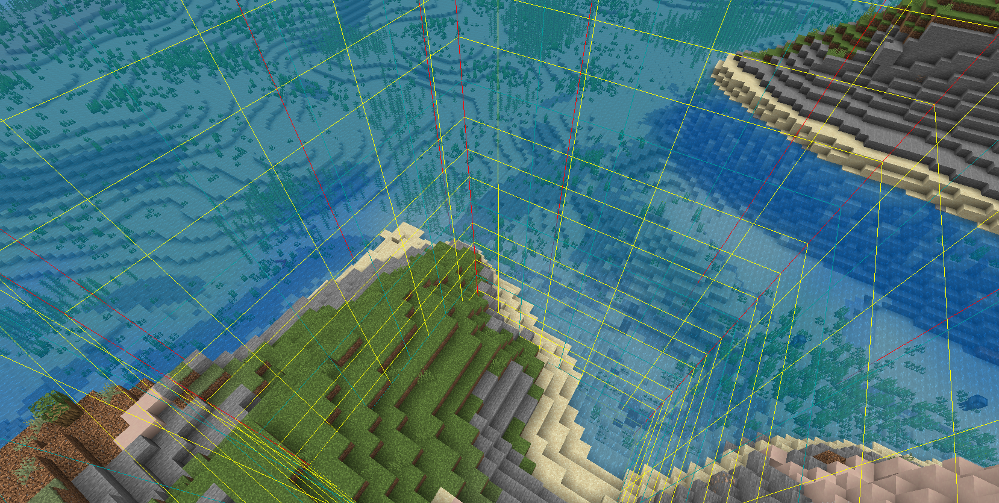

# Территории

#### Приват новой территории

Для того чтобы заприватить новую территорию для поселения, необходимо прописать команду <mark style="color:orange;">/land claim</mark> в том [чанке](territorii.md#chto-takoe-chank), который вы хотите добавить к поселению. Каждый [чанк](territorii.md#chto-takoe-chank) стоит <mark style="color:orange;">10 монет</mark>.

#### Что такое чанк?

Чанк - территория в мире Minecraft размером <mark style="color:orange;">16х16х319 блоков</mark>. \
Чтобы включить отображение чанков в игре есть комбинация клавиш <mark style="color:orange;">F3 + G</mark>

<figure><figcaption>
<em>Так выглядит выделение чанка с включенным F3 + G</em>
</figcaption></figure>
